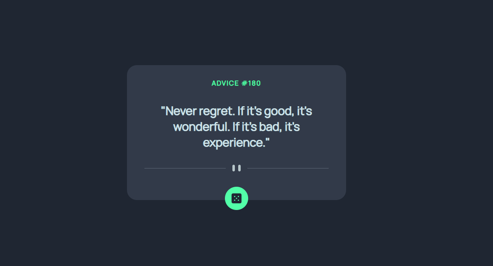

# Frontend Mentor - Advice generator app solution

This is a solution to the [Advice generator app challenge on Frontend Mentor](https://www.frontendmentor.io/challenges/advice-generator-app-QdUG-13db). Frontend Mentor challenges help you improve your coding skills by building realistic projects.

## Table of contents

- [Overview](#overview)
  - [The challenge](#the-challenge)
  - [Screenshot](#screenshot)
  - [Links](#links)
- [My process](#my-process)
  - [Built with](#built-with)
  - [What I learned](#what-i-learned)
  - [Useful resources](#useful-resources)
- [Author](#author)

**Note: Delete this note and update the table of contents based on what sections you keep.**

## Overview

### The challenge

Users should be able to:

- View the optimal layout for the app depending on their device's screen size
- See hover states for all interactive elements on the page
- Generate a new piece of advice by clicking the dice icon

### Screenshot



### Links

- Solution URL: [Solution URL](https://github.com/cassiamoraes/Advice-Generator-App)
- Live Site URL: [Live URL](https://cassiamoraes.github.io/Advice-Generator-App/)

## My process

### Built with

- Semantic HTML5 markup
- CSS custom properties
- Flexbox
- CSS Grid
- Mobile-first workflow
- JS
- [API](https://api.adviceslip.com/#object-slip) - Advice Slip
- [Styled Components](https://styled-components.com/) - For styles

### What I learned

To see how you can add code snippets, see below:

```html
<div class="container">

      <div class="id">Advice #</div>
      <div id="text"><p class="text"></p></div>
      <div class="divider"></div>
      <div class="btn"><button></button></div>

  </div>
```
```js
function getAdvice(){
    fetch(url)
    .then(function(res){
        res.json()
        .then(function(data){
            console.log(data)
            id.innerHTML = `Advice #${data.slip.id}`
            text.innerHTML = `"${data.slip.advice}"`
        })
    })
    .catch(function(err){
        console.error('Error')
    })
}
```

### Useful resources

- [Example resource 1](https://medium.com/bruno-pulis/usando-fetch-api-ad0650f13a25) - This helped me for used API.

## Author

- LinkedIn - [Cassia Moraes](https://www.linkedin.com/in/cassia-moraes-797797139)
- Frontend Mentor - [@cassiality](https://www.frontendmentor.io/profile/cassiality)
